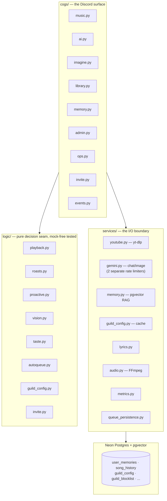

# Dexter ("Dex")

*"i'm back. did you miss me. probably not."*

Dexter is a sarcastic, personality-driven Discord bot: it plays music from YouTube, chats and
roasts via Google Gemini, generates images, and remembers your listening history well enough to
use it against you. Under the personality sits a layered cog → service → logic architecture with
a pure, mock-free-tested decision seam — the engineering underneath is what this document
actually talks about.

**[Live landing page →](https://jadrianports.github.io/dexter)**

## Demo

`docs/demo.gif` is a small, Playwright-rendered reconstruction of the landing page's
Discord-conversation mock (`scripts/render_demo_gif.py` — one source, two derivatives: the same
mock the landing page renders, mechanically re-derived for this README). **It is pending**: the
mock's transcript currently carries placeholder tokens instead of real, verbatim Dexter output
(tracked in [`23-HUMAN-UAT.md`](.planning/phases/23-portfolio-surface-ci-cd/23-HUMAN-UAT.md)),
and this project ships no demo before it ships a fabricated one. Once the real lines land, the
GIF renders from the exact same source the [live landing page](https://jadrianports.github.io/dexter)
already carries — visit it for the up-to-date mock in the meantime. Neither surface is, or claims
to be, a screen recording: the pixels are a reconstruction, the words are real.

## Features

- **Music:** `/play` (search, URL, or playlist import), `/skip` `/pause` `/resume` `/stop`
  `/queue` `/shuffle` `/loop` `/nowplaying` `/replay` `/seek` `/previous` `/jump`, four `/filter`
  presets (opus-copy preserved when no filter is active), SponsorBlock segment-skipping, and a
  **persistent five-button now-playing panel** (play/pause, skip, loop, shuffle, stop) — this
  demo can't show it, so it's called out here instead.
- **AI personality:** `/ask` and `/roast @user`, both grounded in long-term RAG memory; `/imagine`
  image generation; a mood system that sours across a busy day; seasonal awareness; unprompted
  voice-join/late-night/repeat-song roasts and proactive memory callbacks.
- **Long-term memory:** `pgvector`-backed recall with per-guild scoping, a semantic "taste brain"
  distilled from listening history that powers a smarter auto-queue, `/discover`, and
  `/jam suggest`; fully inspectable and erasable via `/memory view` / `/memory forget`.
- **Vision:** cadence-gated `gemini-2.5-flash` image roasts, safety-gated and silent-skip-on-block
  by design.
- **Per-server admin & owner control:** `/setup` onboarding for a fresh server, and an owner
  control plane (`/guilds list|silence|leave|block`) to cut off abuse.
- **Library:** per-user favorites and playlists, per-server shared `/jam` mixtapes.

## Architecture

The line that actually distinguishes this codebase: **decision logic is pure and tested;
Discord and process glue stay thin and untested-by-design.** Every branch that decides
*what Dexter does* — whether a track-end should replay, loop, or auto-queue; whether a roast
should fire; whether a guild is silenced — lives in `logic/` behind a keyword-only, mock-free,
clock-injectable function signature. The cogs and `bot.py` call into that seam and do almost
nothing else.

## A few hard problems

**RAG long-term memory on zero new infrastructure.** Rather than standing up Redis or a
knowledge graph, Dexter's memory is a `pgvector` extension on the Postgres database it already
runs, with `gemini-embedding-001` embeddings on a **separate** 60 RPM rate limiter. That
separation is the actual point: background memory writes (nightly distillation, dedup, decay)
can never starve the user-facing 15 RPM chat budget that `/ask` and `/roast` depend on.

**The `_play_generation` counter.** Every guild's queue carries a monotonically-incrementing
generation number. A track's "on-finished" callback captures the generation it was scheduled
under; if a skip, stop, or replay increments the counter before that callback fires, the stale
callback recognizes it's no longer current and does nothing. Without this, skip/stop races would
double-play tracks — a bug class that's easy to reintroduce and easy to miss in review, so it's
enforced structurally instead of by convention.

**The accuracy firewall.** Long-term memory supplies the *episode* — the vibe, the pattern, the
callback-worthy detail. Live SQL supplies the *number*. No hard count or streak is ever embedded
into memory text, because a stale embedded number would make a roast confidently wrong months
later. This is the rule that keeps a personality feature from quietly corroding factual accuracy,
and it's checked again every time a new memory kind is added.

**Two-choke-point kill-switch enforcement.** The owner control plane doesn't scatter
per-command "are we blocked?" checks across every cog — a future feature would inevitably forget
one. Instead, exactly two enforcement points cover every surface: a `CommandTree.interaction_check`
override gates every slash command, and a pre-send re-check gates every ambient/ambient-adjacent
message right before it's posted (closing the TOCTOU window on async Gemini calls). Silencing or
blocking a guild is a two-site guarantee, not a per-feature habit.

## Honest boundaries

Dexter is built for **one server running full-time on a single owner's machine**, extended
carefully to be safely invitable elsewhere — not for 100+-guild verified scale. Four boundaries,
each stated as constraint → the deliberate decision made about it:

- **The 100-guild verification wall.** Discord requires bot verification past roughly 100
  servers. That process (and the engineering it implies — sharding at scale, support load,
  abuse-response SLAs) is out of scope for this project. **Decision:** stay under the wall,
  disclose it here, and treat "invitable to a handful of servers" as the real target rather than
  quietly implying enterprise readiness.
- **On-demand hosting.** Dexter runs on the owner's residential-IP machine, not a 24/7 cloud
  host — YouTube blocks datacenter IPs outright, which made the free-cloud deploy attempted
  earlier in this project's life non-viable. **Decision:** the bot is genuinely offline unless the
  owner has it running. `CICD-03` (this repo's Docker image, published to GHCR on tag) makes a
  future always-on host a `docker pull` away without committing to standing one up yet.
- **Full-savage personality, reactive mitigation.** The personality does not have a per-guild
  tone dial — Dexter roasts the same way everywhere, including image roasts on whatever gets
  posted. A tone dial per server was judged over-engineering at this project's scale. **Decision:**
  ship the personality as designed, and mitigate the abuse surface reactively with an owner
  control plane (`/guilds list|silence|leave|block`, a persistent blocklist, two enforced choke
  points) rather than trying to prevent every possible bad interaction in advance.
- **Hybrid memory scoping.** Unprompted/ambient recall — `/roast @user`, ambient voice roasts,
  proactive callbacks, the music-command callback, and the auto-queue taste blend — is
  **guild-scoped**: each of those call sites opts in explicitly, narrowing retrieval to the
  current guild plus a legacy globally-recallable corpus predating guild-scoping. **`/ask` stays
  deliberately global**, but it is also **self-scoped** — it only ever recalls the invoking user's
  own memory, so no cross-user exposure is possible either way. The opt-in is per-call-site, never
  inferred from whether a `guild_id` happens to be in scope, precisely because `/ask` has one and
  must not use it for this. Memory writes (`remember`, dedup, per-user eviction) are untouched by
  any of this and stay fully user-scoped. A departed guild's configuration, queues, jams, and
  guild-stamped memories are purged on removal; its blocklist entry, deliberately, is not.

## Add Dexter to your server

https://discord.com/oauth2/authorize?client_id=1492588698364018898&scope=bot+applications.commands&permissions=309240908864

This is the same link `/invite` hands out in Discord and the same one the
[landing page](https://jadrianports.github.io/dexter)'s buttons point at — all three resolve to
`logic/invite.py::build_invite_url()`, the single place this URL is ever constructed
(`tests/test_invite_drift_guard.py` fails the build if any of them ever drift). It requests ten
named permissions (view channels, send messages, embed links, attach files, add reactions, read
message history, connect, speak, create/send in public threads) and explicitly excludes
Administrator, Manage Server, and Manage Roles.

---

*Architecture, scope, and hard-problem detail live here. For the personality demo and the
elevator pitch, see the [landing page](https://jadrianports.github.io/dexter).*
